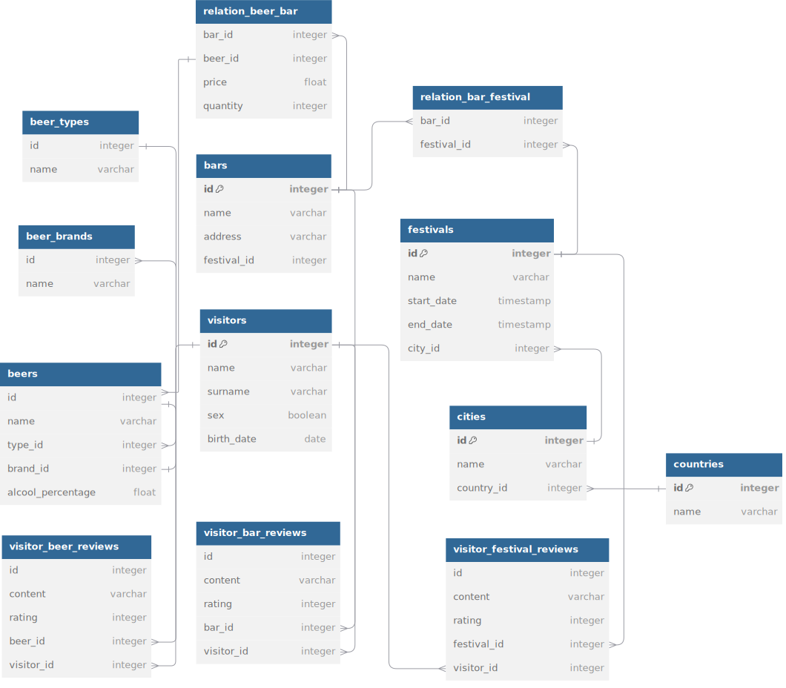

# Festival Management System

This project is a **Festival Management System** designed to facilitate the organization, management, and analysis of festivals, bars, beers, and visitor interactions. The system tracks festivals happening in different cities, the bars and beers associated with those festivals, and feedback from visitors.

---

## Database Structure

### Database Schema

### Entities and Their Roles:

1. **Festivals**:
   - Represents various festivals occurring in different cities.
   - Tracks details such as:
     - **Name**
     - **Start and End Dates**
     - **City** hosting the event.

2. **Visitors**:
   - Represents individuals attending the festivals.
   - Stores personal information:
     - **Name**
     - **Surname**
     - **Gender**
     - **Birth Date**

3. **Bars**:
   - Represents bars participating in festivals.
   - Includes:
     - **Bar Name**
     - **Address**
     - Association with a specific **festival**.

4. **Beers**:
   - Represents beers served in bars during festivals.
   - Tracks details like:
     - **Name**
     - **Type**
     - **Brand**
     - **Alcohol Percentage**

5. **Beer Types**:
   - Represents categories of beers (e.g., Lager, IPA, Stout).
   - Helps classify beers systematically.

6. **Beer Brands**:
   - Represents the brands producing the beers.
   - Identifies the manufacturers behind the beer offerings.

7. **Visitor Reviews**:
   - Visitors can leave feedback and ratings for:
     - **Beers** (`visitor_beer_reviews`)
     - **Bars** (`visitor_bar_reviews`)
     - **Festivals** (`visitor_festival_reviews`)

8. **Relations**:
   - **Bars and Festivals**:
     - Represents the bars participating in each festival.
     - Managed through the `relation_bar_festival` table.
   - **Beers and Bars**:
     - Tracks beers available at specific bars.
     - Includes additional attributes:
       - **Price**
       - **Quantity**

9. **Cities and Countries**:
   - Provides geographical context for festivals.
   - Links festivals to cities and countries.

---

## Key Use Cases:

1. **Event Management**:
   - Organize festivals with associated bars and beers.
   - Assign specific bars to festivals and manage beer offerings.

2. **Visitor Engagement**:
   - Allow visitors to submit reviews and ratings for beers, bars, and festivals.
   - Track visitor demographics and preferences.

3. **Inventory Management**:
   - Monitor beer availability, pricing, and quantities in bars during festivals.

4. **Geographic Insights**:
   - Analyze festival popularity across different cities and countries.

5. **Feedback Analysis**:
   - Evaluate the quality of bars and beers using visitor reviews.
   - Assess festival success through aggregated visitor ratings.

---

## Possible Extensions:
- **Ticketing System**: Manage visitor ticket purchases.
- **Sponsorship Management**: Track sponsors for festivals.
- **Real-time Analytics**: Provide insights into visitor behavior and feedback during events.

This system provides a robust foundation for managing festivals, their associated resources, and visitor experiences.
